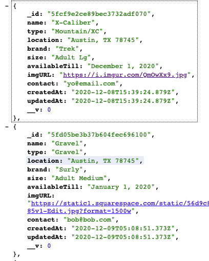
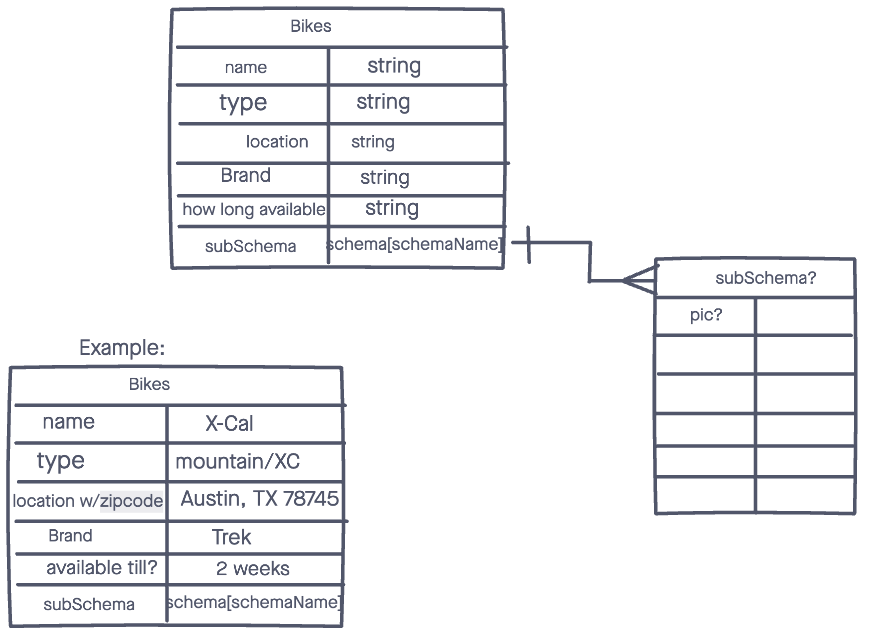

# Pedals

An API connected to MongoDB that stores bike information sent from the front end.

## Installation Instructions

- `npm i`
- create a `.env` file
- set your DATABASE_URL and password in the DB url
- set up a SECRET string
- `npm start` or `nodemon` to run app

## Technologies Used

- Javascript
- Node.js
- Mongoose
- Morgan
- Express
- MongoDB
- bcrypt
- JSON web token
- Heroku

## Screenshots

### ERD Draft:

## Getting Started

[Click Here](https://pedals-backend.herokuapp.com/bikes) to see the deployed app.

## Future Enhancements

- include subSchemas with more information
- allow user to upload pictures instead of URL
- add price info to model/schema
- fix checkAuth function
